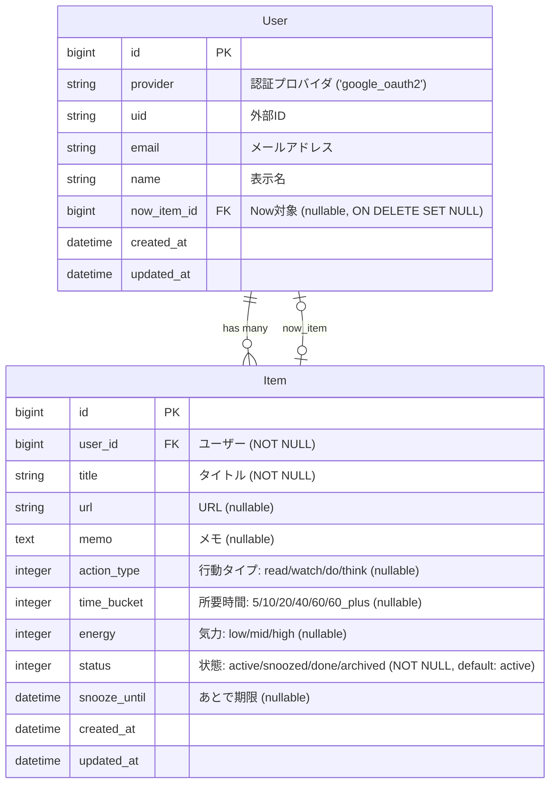

# ER図

```mermaid
erDiagram
    User ||--o{ Item : "has many"
    User |o--o| Item : "now_item"

    User {
        bigint id PK
        string provider "認証プロバイダ ('google_oauth2')"
        string uid "外部ID"
        string email "メールアドレス"
        string name "表示名"
        bigint now_item_id FK "Now対象 (nullable, ON DELETE SET NULL)"
        datetime created_at
        datetime updated_at
    }

    Item {
        bigint id PK
        bigint user_id FK "ユーザー (NOT NULL)"
        string title "タイトル (NOT NULL)"
        string url "URL (nullable)"
        text memo "メモ (nullable)"
        integer action_type "行動タイプ: read/watch/do/think (nullable)"
        integer time_bucket "所要時間: 5/10/20/40/60/60_plus (nullable)"
        integer energy "気力: low/mid/high (nullable)"
        integer status "状態: active/snoozed/done/archived (NOT NULL, default: active)"
        datetime snooze_until "あとで期限 (nullable)"
        datetime created_at
        datetime updated_at
    }
```
